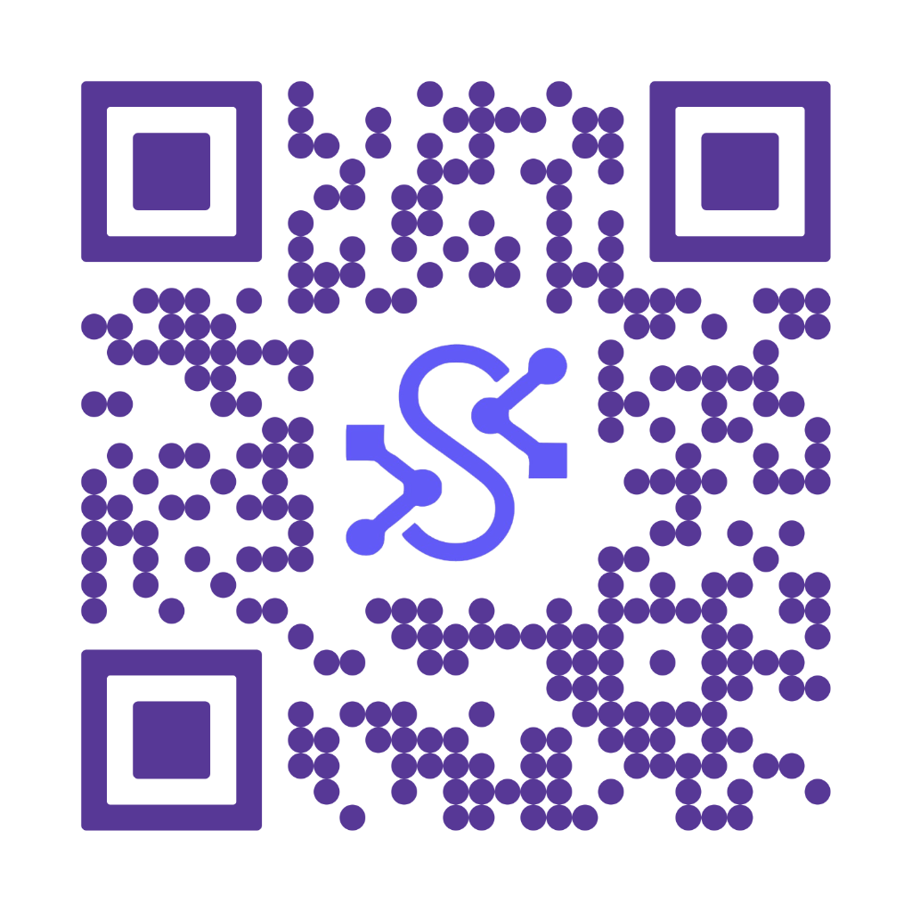

#  Gemini RAG System

Un sistema de **Generación Aumentada por Recuperación (RAG)** de alto nivel, diseñado para ingestar documentos, mantener memoria de conversaciones y realizar búsquedas web inteligentes. Construido sobre **FastAPI**, **Google Gemini**, **LangChain** y **PostgreSQL (pgvector)**.

## 🛠️ Stack Tecnológico

Este proyecto utiliza tecnologías de vanguardia para ofrecer un rendimiento robusto y escalable:

*   **Core:** [Python 3.10+](https://www.python.org/)
*   **API Framework:** [FastAPI](https://fastapi.tiangolo.com/) - Para una API rápida y asíncrona.
*   **LLM & Embeddings:** [Google Gemini](https://deepmind.google/technologies/gemini/) - Modelos `gemini-2.5-flash` y `text-embedding-004`.
*   **Orquestación:** [LangChain](https://www.langchain.com/) - Para la gestión de flujos de RAG y cadenas de procesamiento.
*   **Base de Datos Vectorial:** [PostgreSQL](https://www.postgresql.org/) con extensión [pgvector](https://github.com/pgvector/pgvector).
*   **Memoria:** [Mem0](https://github.com/mem0ai/mem0) - Gestión inteligente de memoria a largo plazo para usuarios.
*   **Búsqueda Web:** [Tavily AI](https://tavily.com/) - Para enriquecer respuestas con información en tiempo real.
*   **Contenedorización:** [Docker](https://www.docker.com/) & Docker Compose.

---

## 📋 Características Principales

1.  **Ingesta Multiformato:** Soporte para PDF, DOCX, XLSX, CSV, TXT, MD, e imágenes.
2.  **Memoria Persistente:** El sistema "recuerda" conversaciones pasadas por usuario gracias a Mem0.
3.  **Búsqueda Híbrida:** Combina conocimiento de documentos locales con búsquedas web vía Tavily.
4.  **Salida Estructurada:** Endpoints específicos para obtener respuestas en JSON o resúmenes de acción.
5.  **Arquitectura Modular:** Servicios desacoplados para RAG, Memoria y Búsqueda.

---

## 🚀 Instalación y Despliegue

### Prerrequisitos
*   Docker y Docker Compose instalados.
*   API Keys para Google Gemini y Tavily.

### Configuración
1.  Clona el repositorio.
2.  Crea un archivo `.env` en la carpeta `rag_gemini` (o raíz según configuración) basado en `.env.example`:

```env
GEMINI_API_KEY=tu_api_key_de_google
TAVILY_API_KEY=tu_api_key_de_tavily
POSTGRES_HOST=db
POSTGRES_PORT=5432
POSTGRES_USER=rag_user
POSTGRES_PASSWORD=rag_password
POSTGRES_DATABASE=rag_db
```

### Ejecución
Levanta los servicios con Docker Compose desde la carpeta del proyecto:

```bash
cd rag_gemini
docker-compose up -d --build
```

El servicio estará disponible en `http://localhost:8005`.

---

## 🔌 Documentación de Endpoints

### 1. Chat Interactivo (`POST /chat`)
Endpoint principal para interactuar con el asistente. Utiliza RAG y Memoria.

**Request:**
```json
{
  "text": "¿Qué dice el documento sobre los requisitos financieros?",
  "user_id": "usuario_123",
  "mode": "hybrid"
}
```

**Respuesta Esperada:**
```json
"Según el documento ingresado, los requisitos financieros son..."
```

### 2. Ingesta de Documentos (`POST /ingest`)
Carga documentos a la base de conocimiento vectorial.

**Request:**
*   `file`: Archivo binario (PDF, DOCX, etc.)

**Respuesta Esperada:**
```json
{
  "message": "Successfully ingested contrato_2024.pdf"
}
```

### 3. Búsqueda Web (`POST /search`)
Realiza una búsqueda en internet utilizando Tavily.

**Request:**
```json
{
  "query": "Noticias recientes sobre inteligencia artificial",
  "search_depth": "advanced"
}
```

**Respuesta Esperada:**
```json
{
  "results": [
    { "title": "Avances en IA...", "url": "...", "content": "..." }
  ]
}
```

### 4. Consulta Estructurada (`POST /api/query`)
Similar al chat, pero devuelve las fuentes citadas y estructura JSON.

**Request:**
```json
{
  "text": "Resumen de garantías",
  "mode": "hybrid"
}
```

**Respuesta Esperada:**
```json
{
  "query": "Resumen de garantías",
  "answer": "Las garantías requeridas son...",
  "sources": [
    { "content": "Fragmento del doc...", "metadata": { "source": "doc.pdf" } }
  ]
}
```

### 5. Finalizar y Resumir (`POST /finalize`)
Genera un resumen estructurado de la conversación y próximos pasos.

**Request:**
Query param: `?user_id=usuario_123`

**Respuesta Esperada:**
```json
{
    "resumen_conversacion": "El usuario consultó sobre...",
    "puntos_importantes": ["Punto A", "Punto B"],
    "pasos_desarrollo": [
        { "descripcion": "Revisar cláusula 5", "completado": false }
    ]
}
```

---

## 📂 Estructura del Proyecto

```
.
├── assets/                # Recursos estáticos (imágenes, logos)
├── rag_gemini/            # Módulo principal del sistema RAG
│   ├── app.py             # Punto de entrada FastAPI
│   ├── rag_service.py     # Lógica RAG (LangChain + Gemini)
│   ├── memory_service.py  # Gestión de Memoria (Mem0)
│   ├── tavily_service.py  # Servicio de Búsqueda Web
│   ├── gemini_client.py   # Cliente directo de Gemini
│   ├── Dockerfile         # Definición de imagen Docker
│   └── docker-compose.yml # Orquestación de servicios
└── README.md              # Documentación del proyecto
```

---

## 🤝 Contribución

1.  Haz un Fork del proyecto.
2.  Crea tu rama de características (`git checkout -b feature/AmazingFeature`).
3.  Haz Commit de tus cambios (`git commit -m 'Add some AmazingFeature'`).
4.  Haz Push a la rama (`git push origin feature/AmazingFeature`).
5.  Abre un Pull Request.

---

## 📞 Contacto y Soporte



Escanea el código QR para más información o soporte directo.

**Desarrollado con ❤️ e IA.**
